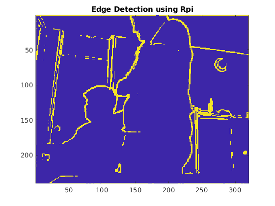

# Edge-Detection-using-Raspberry-Pi-Zero
Edge Detection using Raspberry Pi Zero with MATLAB

Here is what you need for experiment,
```bash
1. Rpi
2. MATLAB
3. RPi Hardware support Tool for MATLAB (Available on MATLAB official website)
```

## Step 1 : Configure MATLAB for RPi. 
- They have very nice GUI that can help you set up easily.

## Step 2 : Run codepiedge.m in matlab. 
- If the connection with Rpi and Matlab is successful then you can see the little GUI, grabing live feed from Rpi camera. Something like this,


